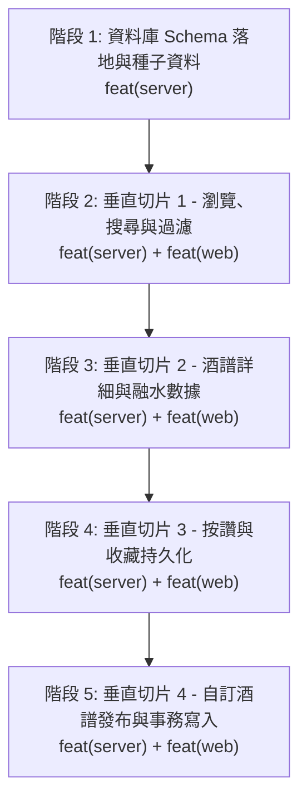

# 酒譜系統後端開發與端到端串接計劃 (Recipes Backend & E2E Plan)

## 1. 背景與目標

- **前置成果**：前端已於 [`docs/plans/ui-prototype-migration.done.md`](./ui-prototype-migration.done.md) 完成 Nuxt 4 + Tailwind CSS v4 介面遷移、狀態解耦與 Layout 佈局系統架設，並已合併至 `main`。
- **架構依據**：以 [`concept/model.dbml`](../../concept/model.dbml) 作為資料庫 Schema 與領域模型之 Single Source of Truth。
- **開發模式**：全面採用 **垂直切片（Vertical Slice Architecture）** 模式。
  - 先完成資料庫基底建設（Drizzle ORM Schema + Migration + Seed Data）。
  - 接著依據使用者故事，每完成一個後端 Feature Slice，即回到前端進行 API 串接與 UI 細節調校（如 Loading 骨架屏、錯誤重試、非同步資料流）。
- **技術棧**：
  - 後端：NestJS 12 + Drizzle ORM 0.45 + PostgreSQL 16
  - 前端：Nuxt 4 + Vue 3.5 + Tailwind CSS v4

---

## 2. Commit 規範與約束

嚴格遵循專案與 Conventional Commits（Angular 規範）：

- `feat(server)`：後端功能或資料庫 Schema 新增
- `feat(web)`：前端頁面、元件或 API 串接新增
- `refactor(server)` / `refactor(web)`：重構未變更外部行為
- `test(server)` / `test(web)`：新增或修改測試
- `docs(plan)`：計劃文件維護與進度更新

---

## 3. 階段式實作與進度清單 (Progress Checklist)



---

### [x] 階段 1：資料庫 Schema 落地、Migration 與種子資料匯入 (Database Foundation & Seed)

- **目標**：根據 `concept/model.dbml` 完整建立 PostgreSQL 關聯資料表，透過 Drizzle ORM 完成型別安全的資料層基底，並匯入標準字典與種子酒譜。
- **工作項目**：
  - [x] 1.1 在 `apps/server/src/db/schema.ts` 定義完整資料表：
    - 標準字典與別名：`canonical_entities`, `entity_aliases`, `flavors`
    - 酒譜核心與關聯：`recipes`, `recipe_ingredients`, `recipe_garnishes`, `recipe_flavors`
    - 社群互動表：`recipe_likes`, `recipe_favorites`
  - [x] 1.2 產生 Drizzle 遷移檔案 (`pnpm db:generate`) 並執行資料庫遷移 (`pnpm db:migrate`)。
  - [x] 1.3 撰寫 `apps/server/src/db/seed.ts`，匯入杯型/品牌/風味實體與 4 款經典種子調酒資料。
  - [x] 1.4 撰寫資料庫連線與查詢測試 (`apps/server/src/db/schema.spec.ts`)。
- **完成 Commit**：
  ```bash
  feat(server): define taxonomy, recipes, and social schema with drizzle migrations
  feat(server): implement database seed script for canonical entities and seed recipes
  test(server): add database schema relations and seed verification tests
  ```

---

### [x] 階段 2：垂直切片 1 —— 酒譜瀏覽、搜尋與複合過濾 (Browse & Filter Recipes)

- **目標**：建立酒譜列表與過濾 API，並於前端完成非同步 API 串接與 Loading 體驗優化。
- **工作項目**：
  - [x] 2.1 後端實作 `RecipesModule`、`RecipesController` 與 `RecipesService`：
    - 端點：`GET /api/recipes`
    - 查詢參數：`search`, `base`, `flavor`, `abv`, `sort`, `page`, `limit`
    - 結合關聯表查詢材料、品牌與風味標籤，回傳結構化 JSON。
  - [x] 2.2 前端串接：
    - `useRecipeStore` 改用 `$fetch` / `useFetch` 取得後端酒譜。
    - 在 `RecipeGrid` 增加 Skeleton 骨架屏載入動畫。
    - 處理連線錯誤與重試機制。
- **完成 Commit**：
  ```bash
  feat(shared): add shared zod dtos and zod validation pipe
  feat(server): implement recipes listing and filter api with tdd
  feat(web): integrate recipes api with loading skeleton and server-side filtering
  ```

---

### [x] 階段 3：垂直切片 2 —— 酒譜詳細資訊與技法融水 (Recipe Details & Dilution)

- **目標**：提供單一酒譜完整資訊端點，並支援詳細彈窗與未來獨立頁面渲染。
- **工作項目**：
  - [x] 3.1 後端端點：`GET /api/recipes/:id`（回傳材料比例、裝飾物、調製步驟與物理預估數值）。
  - [x] 3.2 前端串接：
    - `RecipeDetailModal` 透過 API 即時讀取最新酒譜資料。
    - 保留前端技術模擬器（Stir/Shake）之即時稀釋推估能力。
- **完成 Commit**：
  ```bash
  feat(shared): add recipeIdParamSchema and recipeIdSchema
  feat(server): implement get recipe detail api with full relations
  feat(web): integrate recipe detail api and dilution simulator
  ```

---

### [x] 階段 4：垂直切片 3 —— 社群互動持久化 (Likes & Bookmarks)

- **目標**：使使用者的按讚與收藏狀態真實寫入 PostgreSQL。
- **工作項目**：
  - [x] 4.1 後端端點：
    - `POST /api/recipes/:id/like`
    - `POST /api/recipes/:id/favorite`
  - [x] 4.2 前端串接：
    - 點擊按讚/收藏時採用樂觀更新（Optimistic UI），發出 API 請求並在失敗時復原。
- **完成 Commit**：
  ```bash
  feat(server): implement recipe like and favorite endpoints
  feat(web): connect like and favorite actions with optimistic ui updates
  ```

---

### [ ] 階段 5：垂直切片 4 —— 新增自訂酒譜與事務寫入 (Create Custom Recipe)

- **目標**：完成前台表單發布至後端資料庫事務儲存。
- **工作項目**：
  - [ ] 5.1 後端端點：`POST /api/recipes`
    - 使用 Drizzle 事務（Transaction）同步寫入 `recipes`, `recipe_ingredients`, `recipe_flavors`。
    - 伺服器端資料校驗（DTO Validation）。
  - [ ] 5.2 前端串接：
    - `AddRecipeModal` 送出即時呼叫 API，成功後加入列表並彈出 Toast。
- **預計 Commit**：
  ```bash
  feat(server): implement recipe creation api with drizzle transaction
  feat(web): connect add recipe form to api with toast notifications
  ```

---

## 4. 斷點續做與交接說明

1. 查看上方進度清單（`[x]` 表示完成，`[ ]` 表示待進行）。
2. 使用 `git log -n 5 --oneline` 確認最新 Commit。
3. 遵循單一職責與 Conventional Commits。
