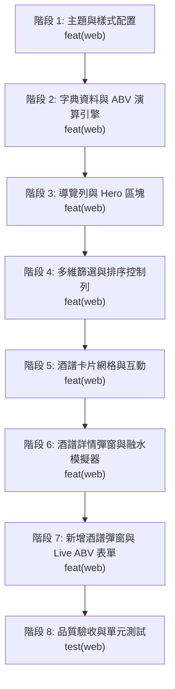

# UI Prototype 遷移至 apps/web 實作計劃

## 1. 背景與目標

- **來源檔案**：`concept/ui-prototype.html`（Gemini Canvas 生成之調酒酒譜查詢與 ABV 運算引擎原型）。
- **目標位置**：`apps/web`（Nuxt 4 + Bootstrap 5 前端專案）。
- **實作原則**：
  - **樣式庫**：以 Bootstrap 5 + SCSS 為基底，實作 Speakeasy 暗色調酒酒吧風格。
  - **模組架構**：初步將功能完整實作於 `/pages`（`app/pages/index.vue`）與必要之共用邏輯（如 `app/utils/` 物理運算引擎與字典），不預先過度拆分組件，確保原型能快速完整運行並易於評估。
  - **狀態持久化**：使用 `localStorage` 作為前端酒譜資料與收藏儲存庫，內建 4 款經典種子調酒資料。
  - **版本控制顆粒度**：細緻拆分階段，嚴格遵守 Conventional Commits 規範，確保每次 commit 範圍清晰可控。

---

## 2. Commit 規範與約束

根據專案與 Conventional Commits（Angular 規範）：

- **`feat`**：新增功能或介面特性（**包含 UI 樣式、主題與 SCSS 配置**）。
- **`refactor`**：既有功能或樣式架構重構（未新增功能或修復 bug）。
- **`fix`**：修復功能瑕疵或樣式跑版 bug。
- **`test`**：新增或修改測試檔案。
- **`style`**：**僅限程式碼格式風格**（如縮排、空白、分號、eslint/prettier 格式化），**不可**用於代表 CSS/UI 樣式。
- **`docs`**：文件修改或說明文件建立。

---

## 3. 階段式實作與進度清單 (Progress Checklist)



---

### [ ] 階段 1：基礎主題、字型與 Bootstrap SCSS 配置

- **目標**：建立 Speakeasy 暗色調酒主題與排版基底。
- **檔案變動**：
  - `apps/web/nuxt.config.ts`：設定 Google Fonts（Inter, Playfair Display）與 Font Awesome 6 CDN。
  - `apps/web/app/assets/scss/main.scss`：配置暗色主題色彩變數（`#0a0c10`, `#11141c`, `#171b26`, `#1f2433`、琥珀金 `#f59e0b`）、自訂滾動條、卡片發光與毛玻璃效果。
- **預計 Commit**：
  ```bash
  feat(web): configure dark speakeasy theme and typography with bootstrap scss
  ```

---

### [ ] 階段 2：標準字典庫（Taxonomy）與 ABV 融水物理計算引擎

- **目標**：移植原型的物理演算核心與標準字典庫，提供完整的 TypeScript 型別定義。
- **檔案變動**：
  - `apps/web/app/utils/taxonomy.ts`（或 `types`）：
    - 杯型字典（Old Fashioned, Martini, Coupe, Highball, Nick & Nora 含中英同義詞）。
    - 品牌字典（Tanqueray, Campari, Carpano, Bacardi, Maker's Mark, Angostura 等，含預設 ABV、分類與別名庫）。
    - 10 種多維風味輪廓（酸爽、甘甜、苦韻、氣泡、果香、花香、草本、煙燻、辛辣、清爽）。
    - 原料名稱關鍵字預設 ABV 比對表。
  - `apps/web/app/utils/abvEngine.ts`：
    - 各技法融水稀釋率（Stir: 22%, Shake: 33%, Build: 18%, Blend: 45%, Layer: 0%）。
    - 演算出酒總量、融水量、純酒精克數、三元液體比例（酒精/副材料/融水）。
    - ABV 濃度分級（無酒精、輕盈 ≤12%、微醺 13-22%、濃烈 >22%）與標準飲酒當量（啤酒換算）。
  - `apps/web/app/utils/seedData.ts`：
    - 4 款經典種子酒譜（Negroni, Old Fashioned, Hendrick's G&T, Classic Daiquiri）。
- **預計 Commit**：
  ```bash
  feat(web): add cocktail taxonomy, abv calculation engine and seed data
  ```

---

### [ ] 階段 3：頁面路由架構、頂部導覽列與 Hero 區塊

- **目標**：打通 Nuxt 4 頁面路由架構，實作導覽列與 Hero 橫幅。
- **檔案變動**：
  - `apps/web/app/app.vue`：改為渲染 `<NuxtPage />` 與全域深色容器。
  - `apps/web/app/pages/index.vue`：建立首頁框架。
  - 頂部導覽列：BarCraft Logo、全域搜尋列（含清空按鈕與同義詞即時擴展）、我的收藏切換按鈕、新增酒譜觸發按鈕。
  - Hero 區塊：品牌標語、ABV 引擎簡介與沉浸式發光背景。
- **預計 Commit**：
  ```bash
  feat(web): implement layout, header navigation with search, and hero section
  ```

---

### [ ] 階段 4：多維篩選與排序控制列（Filter & Sorting Toolbar）

- **目標**：提供多維度的酒譜快速過濾與排序機能。
- **檔案變動**：
  - `apps/web/app/pages/index.vue`：
    - 風味輪廓快捷標籤列（橫向滾動膠囊、重設風味按鈕）。
    - ABV 酒精濃度分級快速過濾器（全部、無酒精、輕盈、經典微醺、濃烈）。
    - 7 大基酒分類切換標籤（全部、琴酒、威士忌、蘭姆、龍舌蘭、伏特加、白蘭地、其他）。
    - 排序下拉選單（熱門讚數、最新、酒名 A-Z、ABV 由高至低、ABV 由低至高）與酒譜數量即時統計。
    - 啟用中篩選條件標籤列（Active Filter Tags）與「清除全部條件」按鈕。
- **預計 Commit**：
  ```bash
  feat(web): implement flavor, abv, spirit filters, and sorting toolbar
  ```

---

### [ ] 階段 5：酒譜卡片網格展示、互動按鈕與空狀態

- **目標**：將酒譜以 Bootstrap 響應式網格展示，支援書籤收藏與按讚。
- **檔案變動**：
  - `apps/web/app/pages/index.vue`：
    - 響應式卡片網格（Row / Col 排版，在手機 1 欄、平板 2 欄、桌機 3 欄）。
    - 卡片元件：酒圖封面、基酒標籤、預估 ABV 徽章（依酒精濃度變換色彩）、收藏按鈕、中英文品名、風味膠囊（點擊可反向過濾）、指定品牌配方標籤、愛心按讚數。
    - 空狀態（Empty State）：查無相符酒譜時顯示專屬圖示與重設篩選條件按鈕。
- **預計 Commit**：
  ```bash
  feat(web): implement recipe cards grid, like and favorite interactions, and empty state
  ```

---

### [ ] 階段 6：酒譜詳情彈窗（Detail Modal）與技法融水模擬器

- **目標**：呈現酒譜完整配方、步驟、科學數據與互動式模擬。
- **檔案變動**：
  - `apps/web/app/pages/index.vue`：
    - Bootstrap Modal 封裝的酒譜詳情彈窗。
    - 橫幅酒照、品名、基酒、技法標籤、杯型/冰塊/裝飾物小卡。
    - ABV 物理數據面板：預估酒精度、融水稀釋率、純酒精克數、總液體量、三元液體比例彩色進度條、標準杯換算。
    - **技法融水模擬器**：可點擊 Stir / Shake / Build / Blend / Layer 即時推算手法對出杯濃度的影響，並支援一鍵恢復預設值。
    - 指定品牌材料清單、逐項調製步驟、調酒師署名、彈窗內按讚與收藏按鈕。
- **預計 Commit**：
  ```bash
  feat(web): implement recipe detail modal and technique dilution simulator
  ```

---

### [ ] 階段 7：新增酒譜彈窗（Add Modal）與即時 Live ABV 試算表單

- **目標**：提供使用者動態編輯配方，並透過融水模型即時預估濃度。
- **檔案變動**：
  - `apps/web/app/pages/index.vue`：
    - 新增酒譜 Modal：中文品名、英文品名、基酒、技法、署名、杯型/冰塊/裝飾物（含 HTML Datalist 預設選單）。
    - 風味標籤多選選取器。
    - **動態材料列表**：可動態增減列、原料名稱自動判定預設酒精度、指定品牌即時補全下拉選單、份量與單位（ml, oz, dashes, 匙, 補滿）、微調酒精 %。
    - **即時 Live ABV 試算儀表**：表單輸入原料時即時更新預估酒精度、濃度分級徽章與液體比例條。
    - 動態調製步驟列表、風味描述、圖片上傳預覽（FileReader Base64）。
    - 表單驗證、寫入 LocalStorage 與頁面自動重整。
    - Toast 浮動操作提示元件（成功發布、收藏狀態切換等）。
- **預計 Commit**：
  ```bash
  feat(web): implement add recipe modal with dynamic ingredient rows and live abv meter
  ```

---

### [ ] 階段 8：品質驗收、靜態檢查與測試案例

- **目標**：確保符合專案程式碼規範，無警告、無 console.log 殘留，並通過單元測試。
- **工作項目**：
  - 針對 `abvEngine.ts` 撰寫 Vitest 單元測試於 `apps/web/test/abvEngine.spec.ts`，驗證各技法稀釋率、純酒精重量與 mocktail 臨界值計算。
  - 執行並通過所有檢查指令：
    - `pnpm run lint`（ESLint）
    - `pnpm run lint:style`（Stylelint）
    - `pnpm --filter web test`（Vitest）
    - `pnpm --filter web build`（Nuxt 編譯檢查）
- **預計 Commit**：
  ```bash
  test(web): add unit tests for abv engine and component integration
  ```

---

## 4. 斷點續做與交接說明

若對話中斷或由其他開發者接手：

1. 先查看本文件上方進度清單（`[x]` 表示已完成，`[ ]` 表示待進行）。
2. 使用 `git log -n 5 --oneline` 確認目前最新的 commit 狀態。
3. 依序從下一個未完成的階段開始執行，確保遵守單一職責與 Conventional Commit 訊息格式。
4. 每次階段完成後，請將本文件的對應項目更新為 `[x]` 並記錄相關備註。
